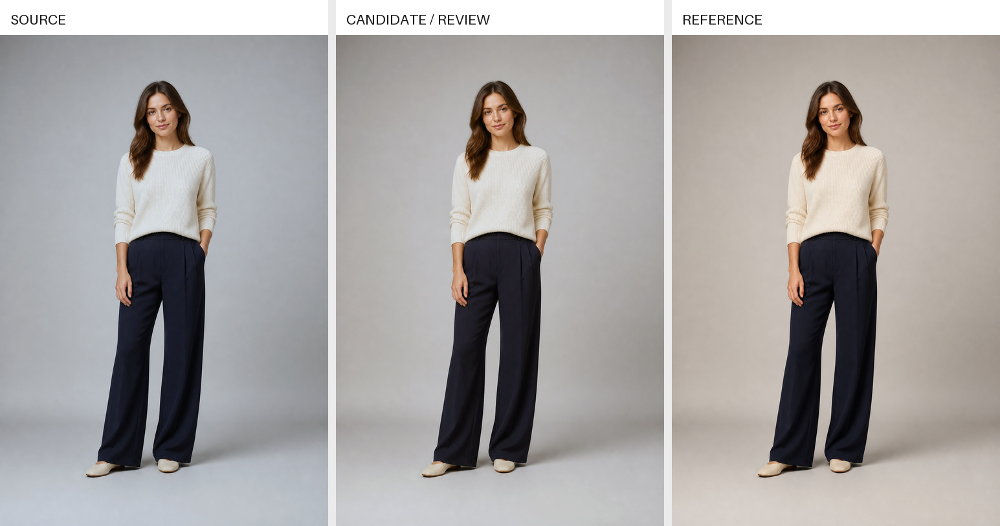

<div align="center">

# Batch Color Standardizer

### 一张参考图，统一一整套 SKU 的背景、人物与服装色彩

把冷暖、明暗、肤色和背景不一致的成品图，收敛到同一套视觉标准。

Local-first, region-aware color standardization for fashion SKU image sets.


[](LICENSE)

[解决的问题](#它解决什么问题) · [工作原理](#核心原理) · [主要能力](#默认能力) · [能力边界](#能力边界)

</div>



<p align="center"><sub>原创合成图演示：左侧为人为制造色偏的输入，中间为本项目生成的待复核候选，右侧为参考标准。背景差异指标由 3.219 降至 1.792；该示例用于说明工作流程，不代表物理绝对商品色。</sub></p>

## 它解决什么问题

同一 SKU 的 5～7 张成品图，经常因为动作、背景和生成条件不同，出现冷暖、曝光、肤色和服装观感不一致。本项目让每个 SKU 使用自己的参考图作为标准，批量缩小这些差异。

- **套系一致**：背景、人物和服装向同一视觉标准靠拢。
- **过渡自然**：人物整体使用平滑变换，减少脸、脖子、头发和服装之间的色块与分层。
- **对象保护**：书本、商标、配饰和指定商品可以保持原色。
- **本地处理**：Mac 本地运行，不上传业务图片，不依赖 NVIDIA 显卡或云端服务器。

## 核心原理

```text
标准参考图 + 需要校色的图片
              ↓
       识别背景和人物
              ↓
比较亮度、冷暖和颜色分布的差异
              ↓
计算幅度受限的平滑颜色变换
              ↓
结合保护区域，从原图一次完成渲染
              ↓
输出候选图、蒙版、对照图和报告
```

默认采用最稳定的“两区校色”逻辑：

1. **背景单独追色**：让背景向参考图的背景效果靠拢。
2. **人物整体追色**：服装、皮肤和头发共用一条平滑的颜色变换。

人物整体共用一条变换，可以减少脸、脖子、头发和服装之间出现色块、分层或不自然过渡。

系统只调整原图像素的颜色，不生成新人物，也不主动重绘服装纹理、文字或画面结构。所有调整尽量从原图一次完成，避免反复处理造成画质损失。

## 默认能力

- 按每个 SKU 自己的参考图进行校色，不让不同 SKU 共用错误标准。
- 分开控制背景和人物的调整强度。
- 使用 OKLab 颜色空间分析亮度和色彩差异。
- 限制调整幅度，保护高光、阴影和中性色。
- 使用软蒙版融合边缘，减少人物轮廓处的断层。
- 使用保护蒙版让指定对象保持原色。
- 正式候选使用 PNG/TIFF 无损输出，JPEG 只用于预览。

## 可选的精细能力

当图片确实需要局部处理时，系统还可以定位：

- 人脸与皮肤
- 头发
- 上衣、裤子、裙子和连衣裙
- 鞋、包和配饰

精细识别默认关闭。只有在局部需求明确、蒙版质量合格时，才会在指定区域内做受限追色，避免增加不必要的复杂度。

系统也可以分析冷暖、曝光和色调差异。这一分析只生成报告，不会在没有授权的情况下自动修改图片。

## 输出结果

每次处理可以生成：

```text
校色输出/SKU/
├── 待复核候选/
├── 蒙版/
├── 预览/
├── 报告/
├── 整套对照.jpg
└── review-status.json
```

所有结果默认都是待复核候选，人工确认后才能进入已批准成品目录。

## 能力边界

这个项目解决的是“套图视觉一致性”，不是只凭普通 sRGB 图片恢复服装的物理绝对颜色。

最终效果仍会受到参考图质量、拍摄光线、面料反光、人物蒙版和局部遮挡影响。商品颜色要求很高时，应结合实物色卡、标准光源或经过人工确认的服装锚点。

## 运行环境与隐私

- 基础模式使用 Python、NumPy、Pillow 和 macOS Vision。
- 不需要 NVIDIA 显卡，也不需要云端服务器。
- 默认在 Mac 本地处理，不会把图片上传到云端。
- 公开仓库不包含用户照片、SKU 数据、个人路径、账号凭据或模型权重。

## 当前状态

- 当前版本：`0.5.3`
- 完整回归：166 项通过，0 失败，0 跳过
- 开源许可：[MIT License](LICENSE)

更详细的技术内容：

- [系统逻辑图](docs/LOGIC_MINDMAP_0.5.3.md)
- [源码交付与复现说明](docs/SOURCE_HANDOFF.md)
- [升级与安全报告](docs/UPGRADE_REPORT_0.5.3_SAFETY_PLANNER.md)
