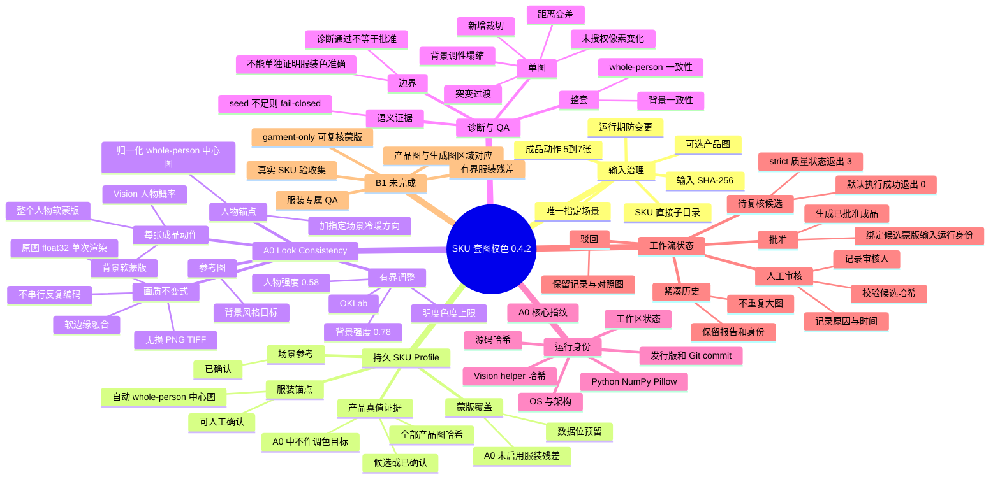

# 0.4.2 当前逻辑思维导图

```mermaid
mindmap
  root((SKU 套图校色 0.4.2))
    输入治理
      SKU 直接子目录
      唯一指定场景
      成品动作 5到7张
      可选产品图
      输入 SHA-256
      运行期防变更
    持久 SKU Profile
      场景参考
        已确认
      产品真值证据
        候选或已确认
        全部产品图哈希
        A0 中不作调色目标
      服装锚点
        自动 whole-person 中心图
        可人工确认
      蒙版覆盖
        数据位预留
        A0 未启用服装残差
    A0 Look Consistency
      参考图
        背景风格目标
      每张成品动作
        Vision 人物概率
        背景软蒙版
        整个人物软蒙版
      人物锚点
        归一化 whole-person 中心图
        加指定场景冷暖方向
      有界调整
        OKLab
        背景强度 0.78
        人物强度 0.58
        明度色度上限
      画质不变式
        原图 float32 单次渲染
        无损 PNG TIFF
        软边缘融合
        不串行反复编码
    诊断与 QA
      单图
        未授权像素变化
        新增裁切
        距离变差
        突变过渡
        背景调性塌缩
      整套
        背景一致性
        whole-person 一致性
      语义证据
        seed 不足则 fail-closed
      边界
        诊断通过不等于批准
        不能单独证明服装色准确
    运行身份
      发行版和 Git commit
      工作区状态
      Python NumPy Pillow
      OS 与架构
      源码哈希
      A0 核心指纹
      Vision helper 哈希
    工作流状态
      待复核候选
        默认执行成功退出 0
        strict 质量状态退出 3
      人工审核
        校验候选哈希
        记录审核人
        记录原因与时间
      批准
        生成已批准成品
        绑定候选蒙版输入运行身份
      驳回
        保留记录与对照图
      紧凑历史
        保留报告和身份
        不重复大图
    B1 未完成
      garment-only 可复核蒙版
      产品图与生成图区域对应
      有界服装残差
      服装专属 QA
      真实 SKU 验收集
```

## 一句话逻辑

**先用 A0 把本 SKU 的背景和整个人物风格拉齐，再用可追溯工作流决定候选是否可批准；在 B1 验收完成前，不把 whole-person 一致性冒充为精准商品色。**
