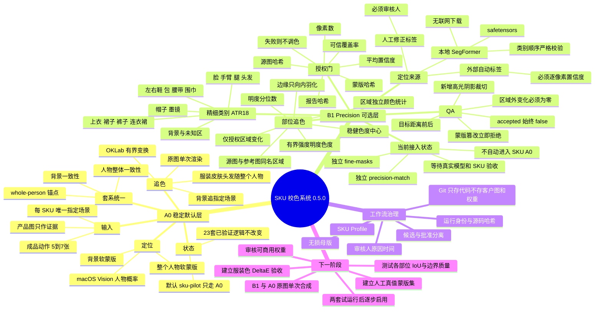

# 0.5.0 当前逻辑思维导图

```mermaid
mindmap
  root((SKU 校色系统 0.5.0))
    A0 稳定默认层
      输入
        每 SKU 唯一指定场景
        成品动作 5到7张
        产品图只作证据
      定位
        macOS Vision 人物概率
        背景软蒙版
        整个人物软蒙版
      追色
        背景追指定场景
        服装皮肤头发随整个人物
        OKLab 有界变换
        原图单次渲染
      套系统一
        whole-person 锚点
        背景一致性
        人物整体一致性
      状态
        默认 sku-pilot 只走 A0
        23套已验证逻辑不改变
    B1 Precision 可选层
      精细类别 ATR18
        上衣 裙子 裤子 连衣裙
        左右鞋 包 腰带 围巾
        帽子 墨镜
        脸 手臂 腿 头发
        背景与未知区
      定位来源
        本地 SegFormer
          safetensors
          无联网下载
          类别顺序严格校验
        外部自动标签
          必须逐像素置信度
        人工修正标签
          必须审核人
      授权门
        像素数
        平均置信度
        可信覆盖率
        源图哈希
        蒙版哈希
        报告哈希
        失败则不调色
      部位追色
        源图与参考图同名区域
        区域独立颜色统计
        明度分位数
        稳健色度中心
        有界强度明度色度
        仅授权区域变化
        边缘只向内羽化
      QA
        目标距离前后
        新增高光阴影裁切
        区域外变化必须为零
        蒙版篡改立即拒绝
        accepted 始终 false
      当前接入状态
        独立 fine-masks
        独立 precision-match
        不自动进入 SKU A0
        等待真实模型和 SKU 验收
    工作流治理
      SKU Profile
      候选与批准分离
      审核人原因时间
      运行身份与源码哈希
      无损母版
      Git 只存代码不存客户图和权重
    下一阶段
      审核可商用权重
      建立人工真值蒙版集
      测试各部位 IoU与边界质量
      建立服装色 DeltaE 验收
      B1 与 A0 原图单次合成
      两套试运行后逐步启用
```

## 一句话逻辑

**日常批量继续走已验证的 A0；需要局部精准时才显式进入 B1，先把“在哪里”验证清楚，再决定“改不改”和“怎么改”，任何不确定区域都不动。**
