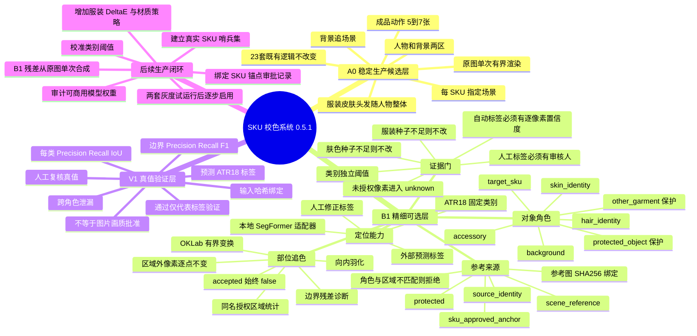

# 0.5.1 当前逻辑思维导图

```mermaid
mindmap
  root((SKU 校色系统 0.5.1))
    A0 稳定生产候选层
      每 SKU 指定场景
      成品动作 5到7张
      人物和背景两区
      背景追场景
      服装皮肤头发随人物整体
      原图单次有界渲染
      23套既有逻辑不改变
    B1 精细可选层
      定位能力
        ATR18 固定类别
        本地 SegFormer 适配器
        外部预测标签
        人工修正标签
      证据门
        自动标签必须有逐像素置信度
        人工标签必须有审核人
        肤色种子不足则不改
        服装种子不足则不改
        类别独立阈值
        未授权像素进入 unknown
      对象角色
        background
        skin_identity
        hair_identity
        target_sku
        accessory
        other_garment 保护
        protected_object 保护
      参考来源
        scene_reference
        sku_approved_anchor
        source_identity
        protected
        角色与区域不匹配则拒绝
        参考图 SHA256 绑定
      部位追色
        同名授权区域统计
        OKLab 有界变换
        区域外像素逐点不变
        向内羽化
        边界残差诊断
        accepted 始终 false
    V1 真值验证层
      预测 ATR18 标签
      人工复核真值
      每类 Precision Recall IoU
      边界 Precision Recall F1
      跨角色泄漏
      输入哈希绑定
      通过仅代表标签验证
      不等于图片画质批准
    后续生产闭环
      建立真实 SKU 哨兵集
      审计可商用模型权重
      校准类别阈值
      绑定 SKU 锚点审批记录
      增加服装 DeltaE 与材质策略
      B1 残差从原图单次合成
      两套灰度试运行后逐步启用
```

## 一句话逻辑

**A0 继续稳定批量出候选；B1 先证明“定位对、对象对、参考对”，再做局部追色；V1 用人工真值量化模型，不确定就不改。**
